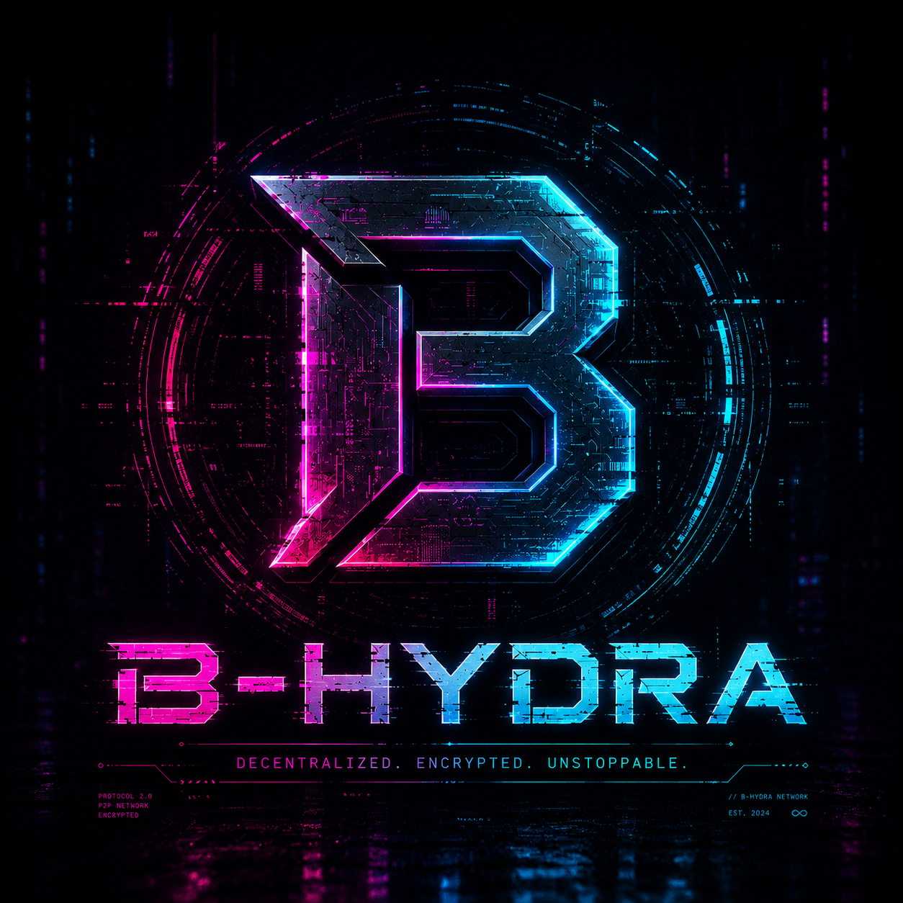

# B-hydra Core — одноранговая электронная денежная система (P2P)

  

**B-hydra Core** — эталонный клиент сети B-hydra (полный узел): кошелёк, майнинг
и P2P-сеть в одном приложении (как Bitcoin Core).

Сайт проекта: [b-hydra.fun](https://b-hydra.fun) ·
[обозреватель цепочки](https://b-hydra.fun/explorer.html) ·
[скачать](https://b-hydra.fun/download.html)

### ⬇️ Скачать готовое приложение (.exe — Python не нужен)

Последняя сборка — в разделе
[**Releases**](https://github.com/vladislav957/B-hydra/releases/latest).
Скачайте файл для своей системы и запустите:

| Система | Файл | Размер |
|---|---|---|
| Windows | `B-hydra-Core-windows.exe` | 12,5 МиБ |
| macOS | `B-hydra-Core-macos` | 10,8 МиБ |
| Linux | `B-hydra-Core-linux` | 25,5 МиБ |

На macOS и Linux файлу нужно дать право на запуск: `chmod +x B-hydra-Core-linux`.

Сборки не подписаны сертификатом издателя, поэтому Windows покажет
предупреждение SmartScreen, а macOS — что разработчик не проверен. Сверьте
контрольную сумму:

    Get-FileHash .\B-hydra-Core-windows.exe    # Windows
    shasum -a 256 B-hydra-Core-macos           # macOS
    sha256sum B-hydra-Core-linux               # Linux

Проверить, вышло ли обновление, и поставить его — одной командой, как у
пакетного менеджера:

    python cli.py update --check     # только посмотреть, что вышло
    python cli.py update             # проверить подпись и установить

⚠️ Установка происходит ТОЛЬКО если манифест релиза подписан ключом проекта.
Контрольная сумма, взятая оттуда же, откуда файл, не доказывает ничего: тот,
кто угнал учётную запись, правит и файл, и сумму рядом с ним. Пока ключ
релизов не заведён, `update` лишь сообщает о новой версии и отправляет
скачать вручную — подробности в `b_hydra/release_key.py`.

SHA-256 версии v0.1.0:

    d6e0caf3405c0e3057f573cbd4378656b084cec049e7a804110d9db9a994b0ff  windows
    dd49ffbe629a05ea0fbe9e8b2894b4fd158a5166c7964009828b9f37de5a82f5  macos
    d864c528ba5ba6c2caea66b0b8b35830b9974195d7396ec3f557824993420772  linux

 ---

Ключевые особенности :
Децентрализованная архитектура : Платформа работает без центрального сервера, обеспечивает полную независимость.
Простота использования : Интуитивно понятный интерфейс и легкая связь с другими группами.
Надёжность и безопасность : гибридная подпись ECDSA + XMSS, устойчивая к квантовому компьютеру; зашифрованный P2P-канал с проверкой целостности кадров.
Масштабируемость : Возможность расширения сети для работ с указанными объемами данных.

 ---

 Установка
Как установить и запустить :
Требования:
Python 3.9 или выше
Установленные в зависимости (см. requirements.txt)
Шаги:
Клонируйте репозитории

Шаги:

1.Клонируйте репозитории:

git clone https://github.com/vladislav957/B-hydra.git
cd B-hydra

2.Установите в зависимости:

pip install -r requirements.txt

3.Запустите проект:

    python bhydra_gui.py      # приложение с окном: кошелёк, майнинг, сеть
    python cli.py             # то же из командной строки
    python manig.py           # демонстрация полного цикла работы

4.Основной алгоритом SHA-512

Установленные в зависимости на Linux:

Шаги:

1.Клонируйте

 git clone
https://github.com/vladislav957/B-hydra.git
cd B-hydra

Пример использования :
После запуска программы вы можете начать майнинг или создать транзакции.

Быстрый старт (полная демонстрация жизненного цикла):

    python manig.py

Пример кода для добавления блока:

from b_hydra import Blockchain

blockchain = Blockchain()
blockchain.add_block(data="Пример транзакции")
print(blockchain.chain)

Командная строка (CLI) — состояние хранится в bhydra_chain.json:

    python cli.py wallet                       # создать кошелёк
    python cli.py init                         # инициализировать цепочку
    python cli.py mine <АДРЕС_МАЙНЕРА>         # добыть блок (награда 50 BHY)
    python cli.py send <ПРИВ_КЛЮЧ> <АДРЕС> 10 --fee 0.5   # перевод
    python cli.py mine <АДРЕС_МАЙНЕРА>         # подтвердить транзакцию в блоке
    python cli.py balance <АДРЕС>             # проверить баланс
    python cli.py chain                        # показать цепочку

Параметры сети B-hydra: хеш SHA-512, консенсус Proof-of-Work, модель UTXO
(транзакции со входами и выходами, как в Bitcoin), награда 50 BHY,
интервал халвинга 310 000 блоков, максимальная эмиссия 31 000 000 BHY.
Сложность — ретаргетинг LWMA на КАЖДОМ блоке: PoW устроен как в Bitcoin —
хеш блока (как 512-битное число) должен быть не больше порога target. Но
пересчёт идёт не раз в окно, а на каждом блоке по скользящему окну последних
RETARGET_INTERVAL = 60 блоков, где свежие интервалы весят больше (linear
weighted moving average): блоки шли быстрее цели → труднее, медленнее → проще
(изменение не более чем в 4 раза за блок, не легче генезиса). Прежняя схема
Bitcoin (раз в окно) при времени блока ~49 мин давала около 3,5 суток инерции.
Больше майнеров → блоки находятся быстрее цели → пересчёт поднимает сложность
(«больше майнеров — труднее» получается само, как в Bitcoin). Порог каждого
блока записан в его заголовок и проверяется всеми узлами.
Эмиссия как у Bitcoin: за блок майнер получает строго 50 BHY, и каждые
310 000 блоков награда делится пополам — 50 → 25 → 12.5 … Потолок
31 000 000 BHY; майнеры получают награду примерно до 3000 года. Халвинг
считается ПО ВЫСОТЕ, а не по календарю (при целевом времени блока это
≈29 лет, но фактический срок гуляет вместе с хешрейтом). Подробности и
готовый раздел для белой книги — ECONOMICS.md.

Структура проекта — ядро оформлено как Python-пакет b_hydra/:

    b_hydra/
      hashing.py / sha2.py   — хеши SHA-512 (обёртки) и SHA-2 «с нуля»
      merkle.py, hashcash.py — дерево Меркла и proof-of-work
      wallet.py              — ключи ECDSA secp256k1 и адреса
      transaction.py         — UTXO-транзакции (входы/выходы), мемпул
      blockchain.py          — блоки, PoW, динамическая сложность
      economics.py           — награда, халвинг, конец эмиссии (3000)
      node.py                — узел: UTXO, балансы, майнинг, синхронизация
      p2p.py, tcp.py         — одноранговая сеть
      api.py, mobile_client.py — REST API и мобильный кошелёк
      contract.py            — смарт-контракт и эскроу
    cli.py, api.py, P2P.py, manig.py — точки входа (запускалки)
    explorer.html            — веб-обозреватель блоков
    tests/                   — автотесты (pytest)

Импорт из пакета:

    from b_hydra import Blockchain, BHydraNode, Wallet, Transaction

Полная карта системы (слои, консенсус, P2P-протокол, модель безопасности) —
в ARCHITECTURE.md.

Хеширование. В цепочке применяются две разные конструкции:

| Что хешируется | Конструкция | Где в коде |
|---|---|---|
| Заголовок блока (PoW) | одинарный SHA-512 | `blockchain.py` → `calculate_hash` |
| `txid` (и то, что подписывается) | одинарный SHA-512 | `transaction.py` → `txid` |
| Листья и узлы дерева Меркла | двойной SHA-512 | `merkle.py` → `_sha512d` |
| Контрольная сумма адреса | двойной SHA-512 | `wallet.py` → `_address_from_payload` |

Тело адреса — RIPEMD-160 от одинарного SHA-512 публичного ключа (своя
реализация RIPEMD-160 в `ripemd.py`: в сборках OpenSSL 3 его часто нет).

SHA-256 в консенсусе не участвует вообще — он используется только в
`certgen.py` (сертификаты для HTTPS), `pqcrypto.py` (режим P256) и `rsa.py`.

Одинарного применения для заголовка достаточно: `nonce` стоит в самом конце
хешируемой строки, а результат сравнивается с целью, поэтому дописать данные
после него нельзя. Для дерева Меркла двойное применение защищает от атаки
удлинением сообщения.

По умолчанию используется реализация «с нуля» (b_hydra/sha2.py, без hashlib).
Значения хешей идентичны hashlib, меняется только скорость (чистый Python
заметно медленнее). Вернуть быстрый движок:

    BHYDRA_PURE_SHA=0 python manig.py        # через окружение
    # или в коде:
    from b_hydra import hashing
    hashing.use_pure_sha(False)

Мобильный кошелёк (REST API) + веб-обозреватель блоков — узел отдаёт JSON по
HTTP и страницу обозревателя; телефон подписывает транзакции локально
(приватный ключ не покидает устройство):

    python api.py --port 8000
    # http://<IP>:8000/         — обозреватель блоков (блоки, транзакции, адреса)
    # http://<IP>:8000/api/info — REST API

Эндпоинты и схема подписи описаны в API.md, эталонный клиент — mobile_client.py.

Десктоп-приложение «B-hydra Core» (tkinter) — единое окно с кошельком,
майнингом и сетью (готовый `.exe` — в разделе Releases, или запуск из исходников):

    python bhydra_gui.py
    # вкладки: 💼 Кошелёк · ⛏ Майнинг · 🌐 Сеть · 🔍 Блоки
    # (нужен tkinter: на Windows/macOS встроен, на Linux — пакет python3-tk)

Возможности приложения:
  * Кошелёк: создать/импортировать ключ, копирование адреса и QR-код для приёма;
  * Перевод с низкой комиссией майнеру (по стандарту крипты);
  * История операций: пополнения/отправки/майнинг «от кого и куда» с датой,
    двойной клик открывает транзакцию в обозревателе блоков;
  * Майнинг в фоне в темпе сети (блок раз в ~48.6 мин, как задаёт ретаргет
    сложности; без ручного «добыть N блоков»);
  * P2P-сеть: запуск узла, авто-синхронизация, seed-узлы, проверка связи и
    авто-поиск других узлов в локальной сети по WiFi (UDP-маяки, без интернета).

P2P-сеть — несколько узлов синхронизируются между собой (рассылка блоков и
транзакций, правило наибольшей накопленной работы — не длины цепочки):

    python P2P.py --port 5101                       # первый узел
    python P2P.py --port 5102 --peer 127.0.0.1:5101 # подключается к первому
    python P2P.py --demo                            # демо из трёх узлов

Автотесты (более 800 тестов: кошелёк, транзакции, блокчейн, узел, экономика,
ретаргетинг сложности, P2P, API, QR, безопасность, XMSS и BDS-обход дерева,
эллиптические кривые, RSA, GPU-майнер, сборка APK, обозреватель в браузере):

    pip install pytest
    pytest

Планы на будущее :
Добавление интерфейса командной строки для системы управления.
Реализация функции автоматической настройки сложности.
Улучшение производительности за счет многоточности.
Интеграция с другими платёжными жизнью.
 ---
[B-hydra.docx](https://github.com/user-attachments/files/19970749/B-hydra.docx)

[B-hydra.pdf](https://github.com/user-attachments/files/20148652/B-hydra.pdf)

 ---
Контакты:
Если у вас есть вопросы или предложения, свяжитесь со мной через GitHub Issues или напишите на: Kovtunvladislav96@gmail.com killnetvladislav@outlook.com

# B-hydra Core — a peer-to-peer electronic cash system (P2P)

**B-hydra Core** is the reference client (full node) of the B-hydra network —
wallet, mining and P2P networking in one app (like Bitcoin Core). Prebuilt
binaries are in
[Releases](https://github.com/vladislav957/B-hydra/releases/latest) —
`B-hydra-Core-windows.exe`, `B-hydra-Core-macos`, `B-hydra-Core-linux`
(on macOS and Linux make the file executable: `chmod +x B-hydra-Core-linux`).
The builds are unsigned, so SmartScreen and Gatekeeper will warn; SHA-256 sums
for v0.1.0 are listed in the Russian section above.

 ---

Key Features: Decentralized Architecture: The platform operates without a central server, ensuring complete independence. Ease of Use: Intuitive interface and easy communication with other groups. Reliability and Security: hybrid ECDSA + XMSS signatures resistant to a quantum computer, and an encrypted P2P channel with per-frame integrity checks. Scalability: The ability to expand the network to work with specified data volumes.

Installation
How to install and run : Requirements: Python 3.9 or higher Installed in dependencies (see requirements.txt) Steps: Clone the repositories

 ---

Steps:

1.Clone the repositories:

git clone https://github.com/vladislav957/B-hydra.git
cd B-hydra

2.Set depending on:

pip install -r requirements.txt

3.Run the project:

    python bhydra_gui.py      # desktop app: wallet, mining, network
    python cli.py             # the same from the command line
    python manig.py           # full lifecycle demo

4.Basic algorithm SHA-512

Installed dependencies on Linux:

Steps:

1.Clone the repositories:

git clone
https://github.com/vladislav957/B-hydra.git
cd B-hydra

Example of usage: After running the program, you can start mining or create transactions.

Quick start (full lifecycle demo):

    python manig.py

Example code for adding a block:

from b_hydra import Blockchain

blockchain = Blockchain()
blockchain.add_block(data="Пример транзакции")
print(blockchain.chain)

Command line (CLI) — state is stored in bhydra_chain.json:

    python cli.py wallet                       # create a wallet
    python cli.py init                         # initialise the chain
    python cli.py mine <MINER_ADDRESS>         # mine a block (50 BHY reward)
    python cli.py send <PRIV_KEY> <ADDRESS> 10 --fee 0.5   # transfer
    python cli.py mine <MINER_ADDRESS>         # confirm the tx in a block
    python cli.py balance <ADDRESS>           # check balance
    python cli.py chain                        # show the chain

B-hydra network parameters: SHA-512 hashing, Proof-of-Work consensus, UTXO
model (transactions with inputs and outputs, like Bitcoin), 50 BHY reward,
halving interval 310,000 blocks, maximum supply 31,000,000 BHY. Difficulty is
retargeted with LWMA on every block over a sliding window of 60; the branch
with the most accumulated work wins, not the longest one.

Future plans: Adding a command line interface for the management system. Implementation of the automatic complexity adjustment function. Improving performance through multi-precision. Integration with other payment services.
 ---
[B-hydra.docx](https://github.com/user-attachments/files/19970757/B-hydra.docx)

[B-hydra.pdf](https://github.com/user-attachments/files/20148653/B-hydra.pdf)

 ---
Contacts: If you have any questions or suggestions, please contact me via GitHub Issues or write to: Kovtunvladislav96@gmail.com killnetvladislav@outlook.com
